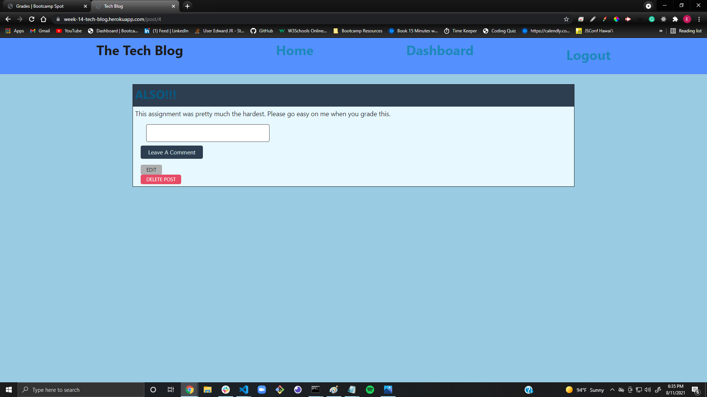

# Tech Blog    
  
[Link To Deployed Application](https://week-14-tech-blog.herokuapp.com) 
# Description
A CMS Style Blog, for all your thoughts!
# Table Of Contents
* [Installation](#installation)
* [Usage](#usage)
* [License](#license)
* [Contributing](#contributing)
* [Tests](#tests)
* [Questions](#questions)
# Installation
User only needs a working browser to run this application.
# Usage
User will first need to create their login credentials by clicking on login, then navigating to the signup form section. Once they provide valid user credentials, they will be able to enter a blog post starting with the title, followed by the post contents. Once they click the "+ New Post" button, they can see their previously created posts to the right. When they click those post links, they can veiw the posts and if they are logged in they will have the option to edit or delete their own posts. The user can also navigate to the home screen and see a list of other posts from all the other users. Users can also comment on other users posts, only if logged in.
# License
This application is protected under conditions of the MIT license.
# Contributing
I am the only contributor to this project.
# Tests
No tests are needed for this application at the moment.
# Questions
My GitHub Profile: http://www.github.com/relentlessreed  
Please feel free to contact me with any inquiries via email at relentlessreed@gmail.com.
